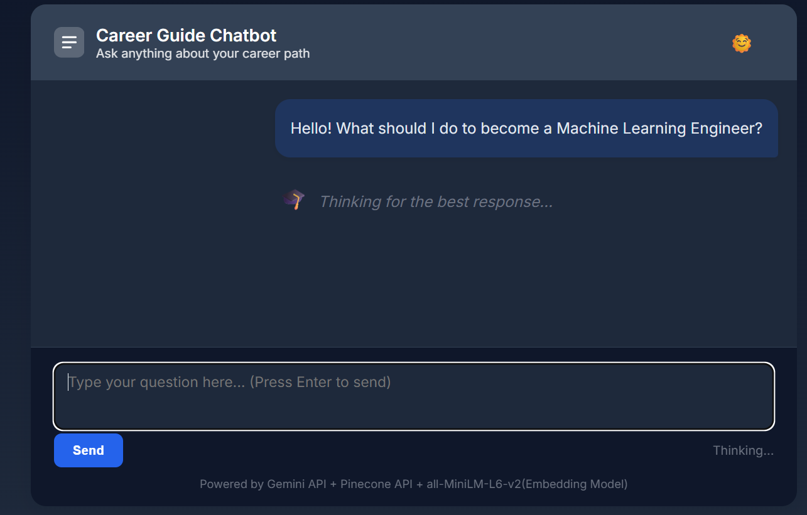
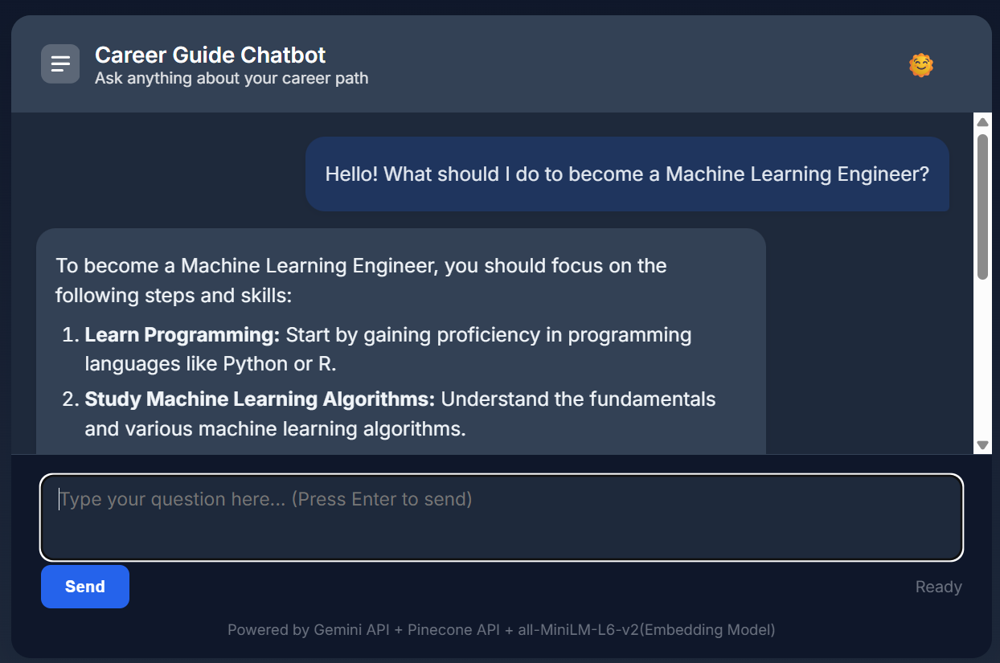
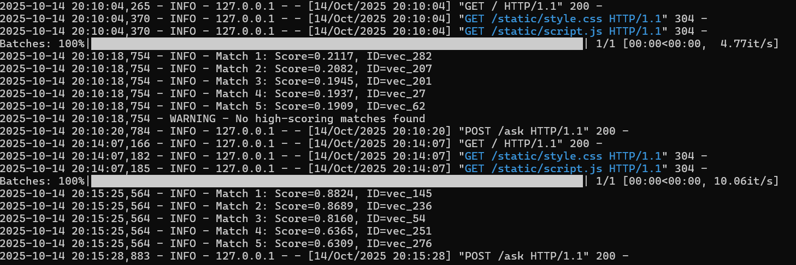

# Career Guide Chatbot
Link: [Career Guide ChatBot](https://career-guide-chat-bot.onrender.com/) This repository contains a Flask-based RAG (retrieval-augmented generation)
demo that answers career-related questions. It uses a public Q/A dataset, a
vector database (Pinecone) for retrieval, and a Large Language Model (Gemini) for
final answer generation.

---

## 1) Project Purpose

The goal of this project is to demonstrate how to build a lightweight career
assistant using a retrieval pipeline. The assistant retrieves relevant Q/A
snippets from a curated dataset and conditions an LLM to produce concise,
actionable, and context-aware answers.

## 2) Dataset

- **Source**: `Pradeep016/career-guidance-qa-dataset` (loaded via the
  `datasets` library).
- **Content**: Role-specific questions and answers about career paths.
- **Note**: The dataset itself is not included in this repo; the code loads it at
  runtime via the `datasets` package.

## 3) Methods and Architecture

- **Embeddings**: The code uses a local `sentence-transformers` model
  (`all-MiniLM-L6-v2`) to generate vector embeddings for semantic search.
- **Vector Store**: Pinecone is used for indexing and retrieving relevant
  context based on the user's query.
- **Generation Model**: The Gemini API (`gemini-1.5-pro-latest`) is used to generate the final,
  human-like answer based on the retrieved context and conversation history.
- **RAG Pipeline**: User Input → Embed → Query Pinecone → Assemble Context → LLM Generate.

## 4) How to Run (Development)

1.  **Create and activate a Python virtual environment:**

    * **Windows (PowerShell):**
        ```powershell
        python -m venv .venv
        .\.venv\Scripts\Activate.ps1
        ```
    * **macOS / Linux:**
        ```bash
        python3 -m venv .venv
        source .venv/bin/activate
        ```

2.  **Install dependencies:**
    ```bash
    pip install -r requirements.txt
    ```

3.  **Copy and edit the environment file:**
    * **Windows:** `copy .env.example .env`
    * **macOS / Linux:** `cp .env.example .env`

    Open the `.env` file and fill it with your API keys. For the app to function correctly, you need:
    - `PINECONE_API_KEY`: Required to connect to your Pinecone index.
    - `GEMINI_API_KEY`: Required to generate answers.

4.  **Run the app:**
    ```bash
    python app.py
    ```
    Open http://127.0.0.1:5000 in your browser.

## 5) Project Structure & Files

- `app.py`: Main Flask application and orchestration logic.
- `seed_pinecone.py`: (Optional) A script to populate the Pinecone index locally.
- `templates/`: UI templates (`index.html`).
- `static/`: Frontend assets (`style.css`, `scripts.js`).
- `requirements.txt`: Python package requirements.
- `Dockerfile`: Instructions to build a container image for deployment.
- `.dockerignore`: Specifies files to exclude from the Docker image.
- `.env` / `.env.example`: Environment variables for API keys.

## 6) Technologies Used

- **Web**: Flask, Gunicorn
- **Embeddings**: sentence-transformers
- **Vector DB**: Pinecone
- **LLM Generation**: Google Gemini API
- **Data**: Hugging Face `datasets`
- **Deployment**: Docker

## 7) Notes on Deployment

This project is configured for container-based deployment on platforms like **Render** or **Railway**.

- The included `Dockerfile` builds a production-ready image for the application.
- When deploying, do not upload your `.env` file. Instead, configure the `PINECONE_API_KEY` and `GEMINI_API_KEY` as **environment variables** in your hosting provider's dashboard.
- The platform will use the `Dockerfile` to build and run the application. A "Start Command" is typically not needed as it's already defined within the `Dockerfile`.

## 8) Screenshots / Visuals

*The UI is intentionally minimal and supports dark/light themes.*



